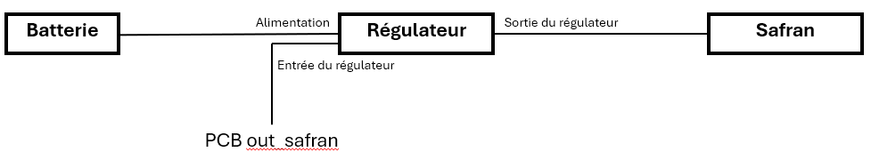
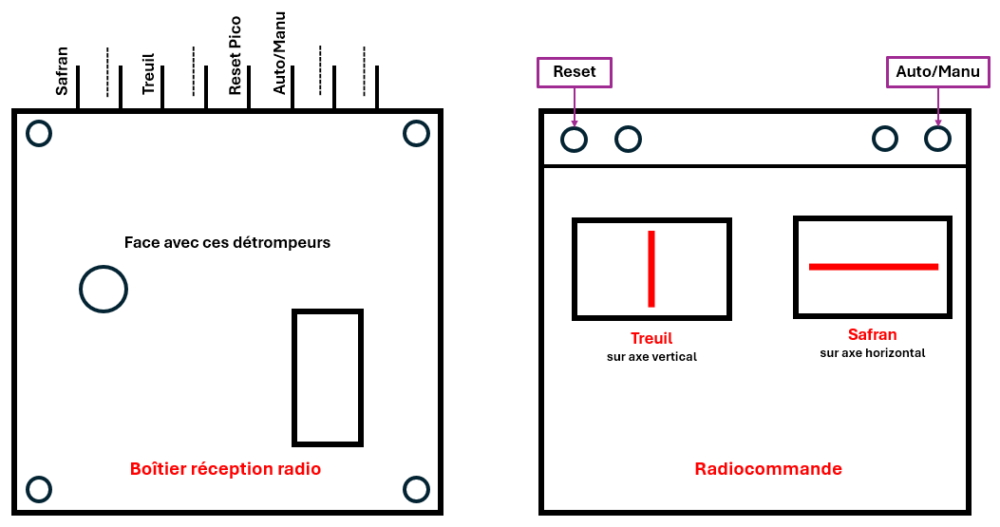
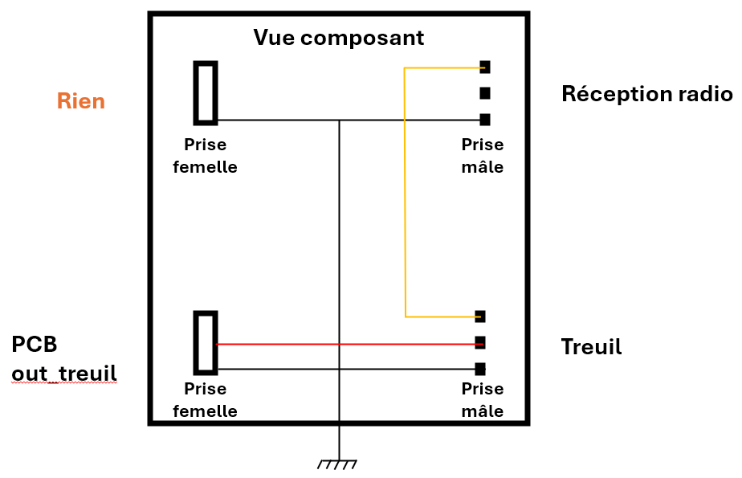

# BatoSEC : Contrôle-Commande du Safran et de la Grand-Voile

Ce dossier présente une sous-partie du projet de voilier autonome, axée sur le **contrôle-commande** du safran et de la grand-voile. L’objectif principal est de **gérer l’orientation** du voilier pour le maintenir sur un cap désiré et ajuster l’ouverture de la grand-voile afin d’optimiser la propulsion en fonction des conditions de navigation.

## Partie SAFRAN

### 1. Objectifs

1. **Acquisition du cap** : Utilisation d’une centrale inertielle (IMU) afin d’obtenir en temps réel l’orientation du voilier (cap).
2. **Commande du safran** : Pilotage d’un servomoteur via un signal PWM (Pulse Width Modulation) pour corriger la trajectoire.
3. **Communication radio ZigBee** : Permettre le **retour d’informations** et la **modification de paramètres** à distance (ordre de cap, etc.) entre le voilier et la station à terre.
4. **Enregistrement des données** : Stocker les mesures (cap, consignes, commandes, etc.) sur une carte SD embarquée pour analyser les performances et affiner les coefficients du correcteur PI de notre régulateur.

### 2. Présentation Générale

#### 2.1 Centrale Inertielle (IMU)
- **But** : Obtenir la valeur du cap (et potentiellement le tangage, le roulis, etc. si nécessaire).  
- **Matériel** : Une IMU (type MPU-6050, BNO055, ou tout autre modèle retenu) reliée à la carte de commande.  
- **Mise en œuvre** : Lecture des données brutes (accéléromètre, gyroscope, magnétomètre), puis application d’un filtre (Kalman ou complémentaire) pour obtenir un cap stable.

#### 2.2 Commande du Safran en PWM
- **But** : Contrôler l’angle du safran (gouvernail) pour corriger la direction du voilier.  
- **Matériel** : Servomoteur (type standard de modélisme) commandé via une sortie PWM.  
- **Mise en œuvre** :  
  1. Configuration d’une broche PWM sur l’Arduino.  
  2. Génération du signal PWM (valeur entre 0° et 180° typiquement).  
  3. Pilotage basé sur la consigne de cap : comparaison entre cap actuel (mesuré par l’IMU) et cap désiré, calcul d’une erreur, et application d’une loi de commande (simple proportionnelle ou PID).

#### 2.3 Communication Radio ZigBee
- **But** : Échanger des données à distance (consignes, relevés de cap, vitesses, etc.) avec une station au sol ou un PC.  
- **Matériel** : Un module radio ZigBee (type XBee ou équivalent) connecté en série (UART) à l’Arduino.  
- **Mise en œuvre** :  
  1. Configuration du module ZigBee (vitesse de transmission, mode API ou transparent).  
  2. Émission périodique des données utiles (cap, consigne de cap, tension batterie, etc.).  
  3. Réception de nouvelles consignes (modification du cap cible, changements de paramètres de réglage, etc.).

#### 2.4 Data Logging sur Carte SD
- **But** : Enregistrer localement les mesures pour analyse ultérieure (tests en mer, validation des algorithmes, etc.).  
- **Matériel** : Un module carte SD relié en SPI (ou via un shield Arduino).  
- **Mise en œuvre** :  
  1. Initialisation de la carte SD et ouverture d’un fichier CSV.  
  2. Écriture des données (date/heure, cap, consigne, angle safran, etc.) dans le fichier.  
  3. Fermeture régulière du fichier pour sécuriser les données.

### 3. Structure du Projet

Le contrôle-commande peut être découpé en plusieurs **sous-programmes** ou **fonctions** dans le code Arduino :

1. **Setup** :
   - Initialisation des bibliothèques (IMU, carte SD, ZigBee).  
   - Configuration des broches utilisées (PWM, SPI, UART).  
   - Calibration initiale de l’IMU si nécessaire.

2. **Boucle Principale (Loop)** :
   - Lecture du cap via l’IMU.  
   - Calcul de l’angle de safran requis selon la loi de commande.  
   - Envoi de l’ordre PWM au servomoteur.  
   - Émission/réception ZigBee.  
   - Enregistrement des données sur la carte SD.

3. **Fonctions de Support** :
   - Fonctions d’écriture et de lecture sur la carte SD.  
   - Fonctions de filtre et de conversion pour l’IMU.  
   - Fonctions de communication (ZigBee).  
   - Fonctions d’asservissement (PID ou Proportionnel).

### 4. Programme de test de régulation du safran en conditions réelles

Dans ce répertoire, vous trouverez un exemple de code Arduino (`test_reg_safran_data_log.ino`) illustrant le fonctionnement minimal pour tester :

1. **La lecture du cap via l’IMU** : Vérifier que l’on récupère bien un angle cohérent.  
2. **La commande PWM du servomoteur** : Appliquer différents angles et observer le mouvement réel du gouvernail.  
3. **La communication ZigBee** : Établir un lien entre l’Arduino et un PC/terminal distant pour recevoir et envoyer des données.  
4. **L’enregistrement sur carte SD** : Consigner à intervalles réguliers le cap mesuré, l’angle du safran et les éventuelles commandes reçues via ZigBee.

#### Points d’attention

- **Alimentation** : Assurez-vous que le servomoteur a une alimentation séparée ou suffisante pour éviter une chute de tension lorsque le servo force.  
- **Masse commune** : Il est impératif de relier la masse du servomoteur, de l’IMU, du module ZigBee et de l’Arduino pour un fonctionnement correct.  
- **Gestion des erreurs** : Prévoyez des messages d’alerte si la carte SD n’est pas détectée ou si la liaison ZigBee est perdue.  
- **Évolutions futures** : Intégration de la grand-voile (système de treuil ou servo de voile), implémentation d’algorithmes PID plus avancés, ajout de capteurs environnementaux (anémomètre, girouette, etc.).

---

## Nouveaux Schémas et Explications

Chaque schéma est destiné à guider les différentes étapes d’assemblage et de configuration :

1. **Nouveau Câblage du Safran (adaptation en puissance)**

2. **Configuration optimisée des canaux de radiocommande**

3. **PCB de Test : Régulation Safran Uniquement**

Ces schémas, accompagnés de la documentation technique (brochage, tension d’alimentation, points de masse partagés), permettront d’assurer :

- Une **installation fiable** et **cohérente** avec la nouvelle PCB.  
- Une gestion claire du **retour manuel** si besoin.  
- Une **évolution progressive** du système, en commençant par la stabilisation de la direction (safran) avant d’intégrer la grand-voile.

---

### Conclusion

Cette sous-partie du projet constitue la **base essentielle** du voilier autonome :  
- Mesurer correctement le cap via l’IMU.  
- Contrôler la direction en utilisant un servomoteur.  
- Communiquer à distance pour superviser et commander le voilier.  
- Stocker les données pour les analyser ultérieurement.

Le fichier de test fournit un exemple concret pour démarrer et valider les principaux **éléments techniques** (capteur, servo, communication, data logging) avant une intégration complète dans le code final.