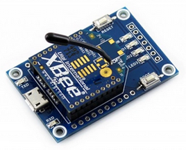
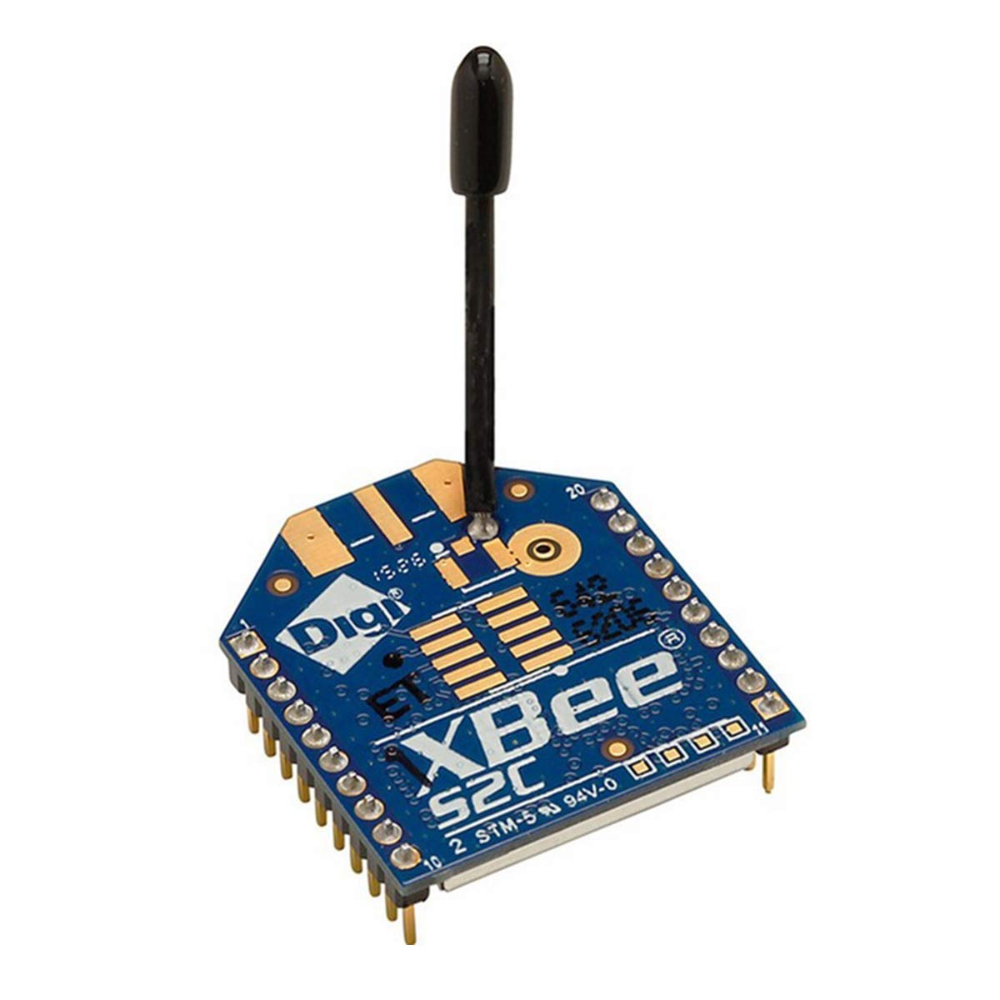

# Utilisation des modules Xbee

Installer le logiciel de configuration des modules qui se nomme [XCTU](https://hub.digi.com/support/products/xctu/).

Pour une configuration des modules en point à point, suivre le [tutoriel suivant](https://www.digi.com/resources/documentation/digidocs/90001526/tasks/t_configure_2_devices_transparent_mode.htm) pour avoir un mode de configuration transparent.

Il faut avoir le support USB pour configurer avec le logiciel.

<div align="center">



Module USB pour Xbee
</div>

Une fois configurés, ces modules peuvent être utilisés sans le support USB, soit en UART, soit en SPI avec un microcontrôleur. Lors de la mise sous tension ou lors d'un reset, il faut impérativement mettre la broche DOUT à HIGH durant le RESET (qui correspond normalement à la broche RXD de l'UART). La configuration de l'UART pour le microcontrôleur doit être la même que celle configurée sur le module. Si vous avez suivi le tutoriel, cela doit être SERIAL_8N1. Le Serial1 correspond pour une Pico à son UART0 et donc le Serial2 à son UART1.

Exemple de code déposé par les professeurs :

```cpp
#include "xbee.h"
#include <Arduino.h>

const int XBee_reset_pin = 21;
const int XBee_rssi_pin  = 28;
const int XBee_dout_pin  = 1;
const int XBee_din_pin   = 0;

void initXBee() {
    pinMode(XBee_rssi_pin, INPUT);

    // **Warning**: DOUT should NOT be LOW during reset (else SPI only mode)!!
    pinMode(XBee_dout_pin, INPUT_PULLUP);
    pinMode(XBee_reset_pin, OUTPUT);
    digitalWrite(XBee_reset_pin, LOW); // pin active low
    delay(10);
    digitalWrite(XBee_reset_pin, HIGH); // pin active low

    pinMode(XBee_dout_pin, INPUT);
    Serial1.setRX(XBee_dout_pin);
    Serial1.setTX(XBee_din_pin);
    Serial1.begin(115200, SERIAL_8N1);
}

void testXBee() {
    static int val = 0;
    Serial1.print("test XBee: ");
    Serial1.println(val++);
}
```

<div align="center">



Module Xbee S2C
</div>
