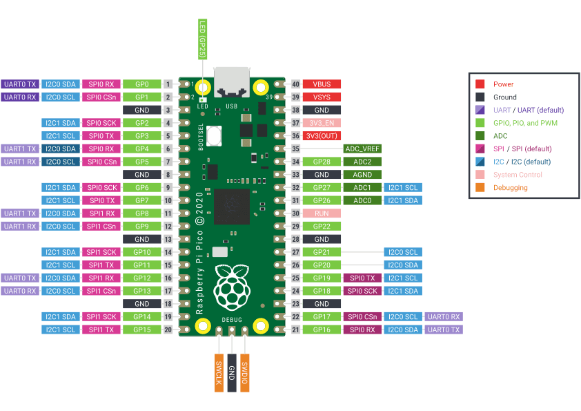

# Documentation du data logger

Le but du data logger est d'enregistrer les données provenant de différents capteurs installés sur le voilier. Cela permet d'obtenir des premières données de terrain. 

Le microcontrôleur utilisé pour ce projet est le Pico H.

Pinout PICO

| Composant                    | Interface | Broches GPIO          |
|------------------------------|-----------|-----------------------|
| MPU 6050 Centrale inertielle | I2C       | I2C0 GP4 & GP5        |
| NEO 6M GPS MODULE            | UART      | UART0 GP0 & GP1       |
| GY-271 Boussole              | I2C       | I2C0 GP4 & GP5        |
| USD card Reader/adapter      | SPI       | SPI0 GP16, 17, 18, 19 |
| Zigbee XBEE-B “xb24c”        | UART      | UART1 GP8 & GP9       |

⚠️ Attention : les micro SD cards fonctionnent en 5V, tandis que la Pico fonctionne en 3,3V sur les broches GPIO. Pour régler le problème on applique des ponts diviseur de tension sur le CS, MOSI, MISO, SCK. (necessite des resistance de avec un rapport 2/3)

Data Logger Breadboard

