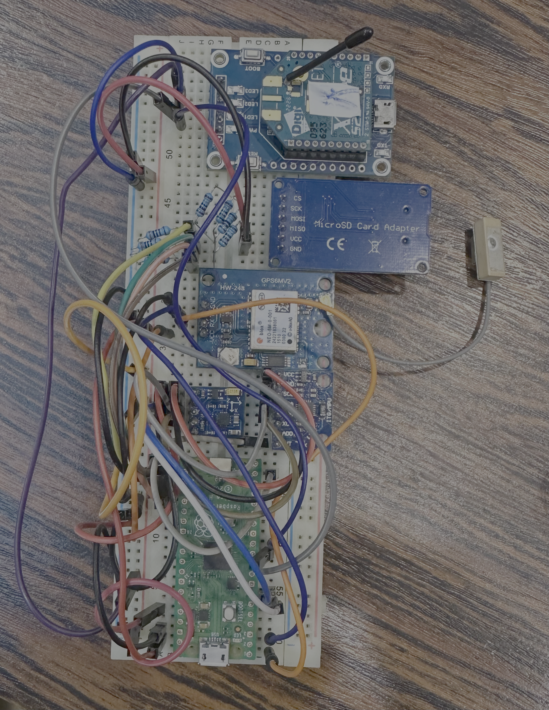

# Documentation du data logger

Le but du data logger est d'enregistrer les données provenant de différents capteurs installés sur le voilier. Cela permet d'obtenir des premières données de terrain. 

Le microcontrôleur utilisé pour ce projet est le Pico H.

## Documentation HARDWARE

Pinout PICO

| Composant                    | Interface | Broches GPIO          |
|------------------------------|-----------|-----------------------|
| MPU 6050 Centrale inertielle | I2C       | I2C0 GP4 & GP5        |
| NEO 6M GPS MODULE            | UART      | UART0 GP0 & GP1       |
| GY-271 Boussole              | I2C       | I2C0 GP4 & GP5        |
| USD card Reader/adapter      | SPI       | SPI0 GP16, 17, 18, 19 |
| Zigbee XBEE-B “xb24c”        | UART      | UART1 GP8 & GP9       |

⚠️ Attention : les micro SD cards fonctionnent en 5V, tandis que la Pico fonctionne en 3,3V sur les broches GPIO. Pour régler le problème on applique des ponts diviseur de tension sur le CS, MOSI, MISO, SCK. (necessite des resistance de avec un rapport 2/3)

Data Logger Breadboard

## Documentation SOFTWARE

Ce projet est un enregistreur de données utilisant un MPU6050, un module GPS, une boussole QMC5883L et une carte SD pour stocker les données.

1. **Initialisation des capteurs et des modules** :
   - MPU6050 : Initialisation et calibration du capteur.
   - Module GPS : Configuration de la communication série avec le module GPS.
   - Boussole QMC5883L : Initialisation de la boussole.
   - Carte SD : Ouverture/création d'un fichier CSV pour stocker les données.

2. **Acquisition des données** :
   - Lecture des données du MPU6050 : Accélération, vitesse angulaire et quaternion.
   - Lecture des données GPS : Latitude, longitude, altitude, vitesse, date et heure.
   - Lecture des données de la boussole : Champs magnétiques sur les axes X, Y et Z.

3. **Enregistrement des données** :
   - Les données sont enregistrées dans un fichier CSV sur la carte SD.
   - Les données incluent un timestamp, les mesures du MPU6050, les données GPS et les mesures de la boussole.

4. **Affichage des erreurs** :
   - Si une erreur se produit lors de l'ouverture du fichier CSV, un message d'erreur est affiché sur le port série.

## Utilisation

1. Connectez les capteurs et les modules à la carte Arduino.
2. Téléversez le code sur la carte Arduino.
3. Les données seront enregistrées dans un fichier CSV sur la carte SD.

## Exemple de données enregistrées

| Mesure           | Valeur        |
|------------------|---------------|
| Timestamp        | 12345         |
| Acceleration_X   | 0             |
| Acceleration_Y   | 0             |
| Acceleration_Z   | 0             |
| Rate_X           | 0             |
| Rate_Y           | 0             |
| Rate_Z           | 0             |
| Quaternion_W     | 1             |
| Quaternion_X     | 0             |
| Quaternion_Y     | 0             |
| Quaternion_Z     | 0             |
| Mag_X            | 100           |
| Mag_Y            | 100           |
| Mag_Z            | 100           |
| Latitude         | 48.8566       |
| Longitude        | 2.3522        |
| Altitude         | 35.0          |
| Speed            | 0.0           |
| Date             | 12/3/2025     |
| Time             | 14:30:45.00   |

### Dépendances

- [I2Cdev](https://github.com/jrowberg/i2cdevlib)
- [TinyGPSPlus](https://github.com/mikalhart/TinyGPSPlus)
- [QMC5883LCompass](https://github.com/mprograms/QMC5883LCompass)
- [SD](https://www.arduino.cc/en/Reference/SD)
- [MPU6050_6Axis_MotionApps20](https://github.com/jrowberg/i2cdevlib/tree/master/Arduino/MPU6050)

### Auteurs

Benjamin Lepourtois & Paul Procaccia

