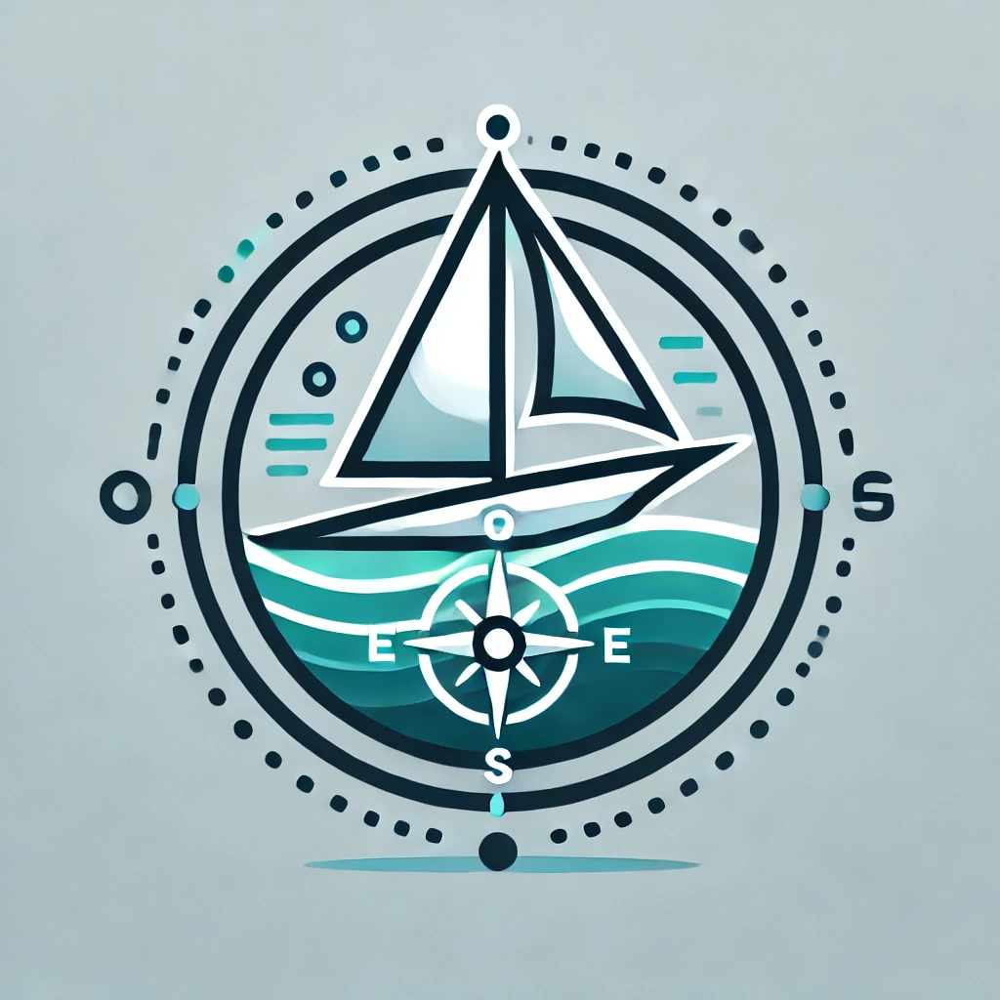

# Plan d’exécution du Projet

*< Version 1.0 >*

*< 4/12/2024 >*

### Auteurs

Bateau Lavoir




```
Romain ASSE
Adji TOURÉ
Cédric FERRÉ

Alexis LEQUEUX
Bastien DELFOUILLOUX

Victor RAVAIN
Baptiste DUBOT

Amaury LEJOLIVET
Alexis ROSSARD
```

## 1. Équipe

*< Liste des membres de l'équipe. Listing des compétences de chaque membres de l’équipe et mise en avant des points différenciants de chacun. >*

* RAS :
* ATO :
* CFE : Linux, C++, Git, Méthodes agiles

* ALEQ :
* BDE :

* VRA :
* BDU :

* ALEJ :
* ARO :


*< Identifiez un membre pour chaque période qui aura la charge de s’assurer de la bonne avancée du projet (ce n’est pas le chef de projet, mais plus un « coach » qui s’assurera que l’équipe fonctionne bien). Ce coach doit être différent à chaque période. >*

Période 13/01/25 au 7/02/25 : 
Période 10/03/25 au 4/04/25 : 
Période 05/05/25 au 28/05/25 : 


## 2. État du projet

### 2.1. Sous-projet : Girouette

Alexis ROSSARD - Amaury LEJOLIVET

#### 2.1.1. Description du produit

*< Décrivez le produit fini attendu. Montrer clairement quels sont les besoins et comment le produit fini va répondre à ces besoins. >*

#### 2.1.2. Fonctionnalités

*< Décrivez les différentes fonctionnalités (nom, description, etc.) de votre produit. >*

*< Priorisez ces fonctionnalités par ordre d’importance pour le produit. >*

#### 2.1.3. Exigences opérationnelles

*< Définissez les exigences opérationnelles de votre produit en quantifiant les objectifs à atteindre. Les clients utiliseront ces objectifs pour valider la conformité de votre produit (et votre projet). Organiser cette partie en identifiant de manière unique chaque exigence unitaire. >*

#### 2.1.4. Plan de validation

*< Définissez votre plan de validation du produit pour démontrer que le produit répond bien aux attentes du client. Vous devez définir les procédures de test et les démonstrations d’usage prévus pour valider les exigences définies avant. >*


### 2.2. Sous-projet : Système de calcul de position & attitude du bateau

Romain ASSE - Adji TOURÉ - Cédric FERRÉ

#### 2.2.1. Description du produit

Une fois fini, le produit devra permettre de connaitre à tout instant des information de position, de vitesse, d'accélération ainsi que d'orientation du bateau.

#### 2.2.2. Fonctionnalités

*< Description des différentes fonctionnalités du produit : >*
* Remontée de position GPS via GPS-RTK.
* Remontée de données de vitesse et d'accélération via IMU.
* Remontée de dérive par rapport au nord magnétique via boussole.

*< Priorisation des fonctionnalités par ordre d’importance pour le produit : >*
1. Position GPS
2. Vitesse & Accélération
3. Dérive par rapport au nord magnétique

#### 2.2.3. Exigences opérationnelles

* La position GPS du bateau devra être remontée sur une ihm à une fréquence minimum de 30Hz.
* Les données de vitesse et d'accélération devront être remontées sur une ihm à une fréquence minimum de 30Hz.
* L'orientation du bateau par rapport au nord magnétique devra être remontée sur une ihm à une fréquence minimum de 30Hz.

#### 2.2.4. Plan de validation

* Pouvoir communiquer la position GPS sans interruption pendant 30 minutes lors d'un parcours dans une zone de 50 mètres par 50 mètres.
* Pouvoir remonter les données de vitesse et d'accélération sans interruption pendant 30 minutes lors d'un parcours dans une zone de 50 mètres par 50 mètres.
* Pouvoir remonter l'orientation du bateau par rapport au nord magnétique sans interruption pendant 30 minutes lors d'un parcours dans une zone de 50 mètres par 50 mètres.

### 2.3. Sous-projet : Conception et test du contrôle du bateau

Victor RAVAIN - Baptiste DUBOT

#### 2.3.1. Description du produit

*< Décrivez le produit fini attendu. Montrer clairement quels sont les besoins et comment le produit fini va répondre à ces besoins. >*

#### 2.3.2. Fonctionnalités

*< Décrivez les différentes fonctionnalités (nom, description, etc.) de votre produit. >*

*< Priorisez ces fonctionnalités par ordre d’importance pour le produit. >*

#### 2.3.3. Exigences opérationnelles

*< Définissez les exigences opérationnelles de votre produit en quantifiant les objectifs à atteindre. Les clients utiliseront ces objectifs pour valider la conformité de votre produit (et votre projet). Organiser cette partie en identifiant de manière unique chaque exigence unitaire. >*

#### 2.3.4. Plan de validation

*< Définissez votre plan de validation du produit pour démontrer que le produit répond bien aux attentes du client. Vous devez définir les procédures de test et les démonstrations d’usage prévus pour valider les exigences définies avant. >*


### 2.4. Sous-projet Conception, implémentation, évaluation des méthodes de planification (tâche et trajectoire) du bateau.

Alexis LEQUEUX - Bastien DELFOUILLOUX

#### 2.4.1. Description du produit

*< Décrivez le produit fini attendu. Montrer clairement quels sont les besoins et comment le produit fini va répondre à ces besoins. >*

#### 2.4.2. Fonctionnalités

*< Décrivez les différentes fonctionnalités (nom, description, etc.) de votre produit. >*

*< Priorisez ces fonctionnalités par ordre d’importance pour le produit. >*

#### 2.4.3. Exigences opérationnelles

*< Définissez les exigences opérationnelles de votre produit en quantifiant les objectifs à atteindre. Les clients utiliseront ces objectifs pour valider la conformité de votre produit (et votre projet). Organiser cette partie en identifiant de manière unique chaque exigence unitaire. >*

#### 2.4.4. Plan de validation

*< Définissez votre plan de validation du produit pour démontrer que le produit répond bien aux attentes du client. Vous devez définir les procédures de test et les démonstrations d’usage prévus pour valider les exigences définies avant. >*


## 3. Planning du projet

### 3.1. Jalons et délivrables

*< Rappelez les dates importantes du projet (périodes, revues, etc.) et les délivrables attendus : ce document, la documentation finale, code, etc. >*

### 3.2. Planning de la première période

*< Pour chaque sous-projet, donnez les objectifs de réalisation sur la première période. Lister les fonctionnalités qui seront opérationnelles à la fin de la période (nom, description) ainsi que leurs tests d’acceptation (autrement dit qu’est-ce qui permettra de dire que la fonctionnalité est réalisée). Attention prenez bien en compte le temps que vous pourrez y consacrer. >*

*< Pour chaque fonctionnalité, évaluez leur difficulté/durée et décomposer les en tâches à mener pour les réaliser. >*


### 3.3. Backlog

*< Backlog: donner la liste des fonctionnalités (nom, description) qui sont planifiées sur les périodes suivantes (pas besoin de préciser sur quelle période). Donner une priorité à ces fonctionnalités (au cas où il faudrait faire un choix). >*

## 4. Management du risque

*< Lister les risques (retard, échec, organisation, manque de connaissance, etc.) possible pour les différents sous-projets. Pour chacun proposer les actions à entreprendre pour prévenir le risque et y répondre s'il survient. >*

 

 